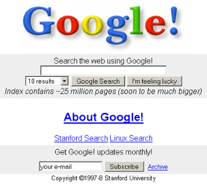

% md-slide demo
% Dániel Kis-Nagy
% 2017.

# md-slide demo

**Demonstration and getting started**

*Press → to start the presentation*

> That, of course, works only in slide view. If you can read this, you are in the notes view!
>
> Slide notes should be written as quotes.
>
> These won't appear on your slides, only in the _\*-notes_ files.
>
> *Did you know you can create formatted text in quote blocks?*
>
>- *You can provide further reading*
>- *You can help yourself remember what you intended to say without making overly cluttered slides*
>- *People unable to attend your presentation live will have a chance to understand what the slide is about*

* * *

# Introduction

> Triple stars mean the end of a slide. (This will make more sense if you actually open the _.md_ file.)

* * *

## You can create code blocks

```html

<!DOCTYPE HTML PUBLIC "-//W3C//DTD HTML 4.01//EN"
 "http://www.w3.org/TR/html4/strict.dtd">
<html>
 <head>
 <title>Title</title>
 <meta http-equiv="Content-type" content="text/html;charset=iso-8859-2"/>
 </head>
 <body>
 Content
 </body>
</html>

```
> As you would expect, syntax highlighting also works

* * *

## Your standard list

- The ```<!DOCTYPE>``` is really long in HTML 4.01
    - HTML5: not anymore!
- Inside ```<html>```, ```<head>``` lets you set _meta stuff_
- In ```<body>```, you can set **actual content**
- If you use HTML in your slides, don't forget to utilize backticks(\`), unless you actually want HTML in your slide

<button style="margin-top: 8px; float:left; width:150px; height:100px; font-size:20px; " onclick="alert('Yay')">Like this!</button>

* * *

## Also, pictures



- If you start your slide with a picture, it will be auto-floated to the right
- We don't auto-resize images here, sorry
	- Make sure you resize your image files
	- It's a bit uncomfortable, I know

* * *

## Multiple images will just appear side-by-side

   

* * *

## What if I don't want floating?

- Just make sure your image isn't the first thing on your slide
- Then it will appear at the bottom nicely


* * *

> ## You can make your slide's title notes-only by putting it in a quote, for, like really long texts

"It was much more effective simply to “support” those -webkit- prefixes that were the analogue of things we already supported; for example, we simply aliased -webkit-border-radius to border-radius.

**Magically, lots of iPhone-only sites looked a lot better in Opera.** As you can see from the screenshot comparisons in the IE blogpost, the same happens for them. **It’s difficult to argue for ideological purity when a simple aliasing makes the user experience so demonstrably better** – and one thing I’ve learned at Opera is **most users don’t care two hoots for ideology if their favourite site works better in another browser.**"

> Source: [http://www.brucelawson.co.uk/2014/on-internet-explorer-supporting-webkit-vendor-prefixes/](http://www.brucelawson.co.uk/2014/on-internet-explorer-supporting-webkit-vendor-prefixes/)
>
> Yes, you can click that link! 

* * *

## Use custom HTML and CSS for complicated stuff

<div style="width: 45%; float: left;">
```JavaScript

# Functions:
square = (x) -> x * x


# Arrays:
list = [1, 2, 3, 4, 5]

# Objects:
math =
root:   Math.sqrt
square: square
```
</div>
<div style="width: 45%; float: left; border-left: 1px solid #ccc; padding-left: 25px;">
```JavaScript

var list, math, square;

square = function(x) {
	return x * x;
};

list = [1, 2, 3, 4, 5];

math = {
  root: Math.sqrt,
  square: square
```
</div>

> Feel free to put those in an external CSS if ```style`` attributes make you shiver.

* * *

# Have fun!

* * *

